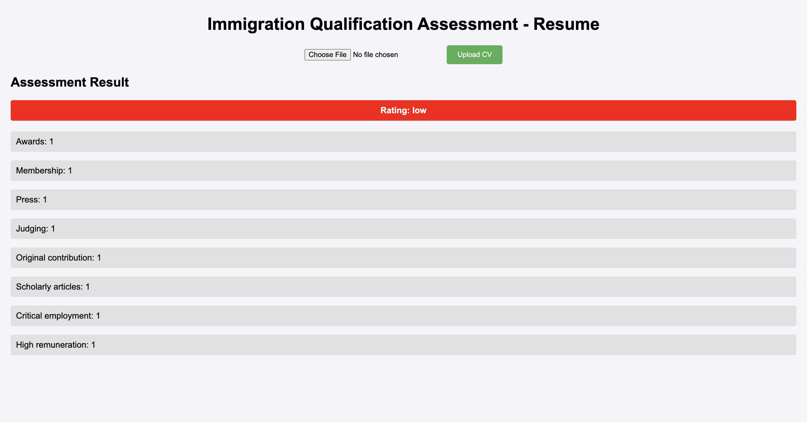

# Immigration Qualification Assessment - Resume

## System Design & Project Architecture

1. Extract textual information from either a PDF or a image (text_extraction.py)
    -- try PDF first, if failing, then open as an image

2. Import a HuggingFace model for text classification given O1A visa criteria (processing.py)
    -- roberta-large-mnli is used in this project for easy and fast deployment
    -- a well-fine-tuned model is suggested for more precise results

3. Output the final score and qualification result for each resume (rating.py)
    -- used average score across criteria
    -- summation is also okay; thresholds must be properly discussed and set


Here are some UI pictures of the project:





## Prerequisites

- Python 3.8 or higher
- pip (Python package installer)
- Tesseract OCR installed and added to PATH
- spaCy model: `en_core_web_sm`

## Required Packages

- fastapi==0.70.0
- uvicorn==0.15.0
- python-multipart==0.0.5
- Jinja2==3.0.3
- pydantic==1.8.2
- transformers==4.15.0
- spacy==3.2.1
- pytesseract==0.3.8
- pdfplumber==0.5.28

## Running the Application

1. Start the FastAPI server:

    ```bash
    uvicorn main:app --reload
    ```

2. Access the application:

    Open a web browser and go to `http://127.0.0.1:8000`


